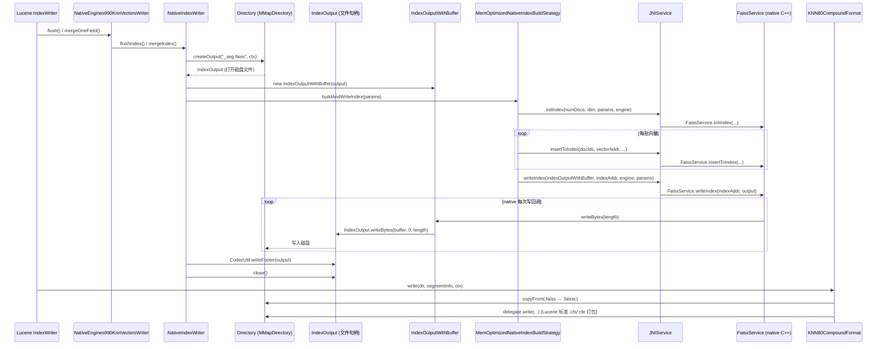
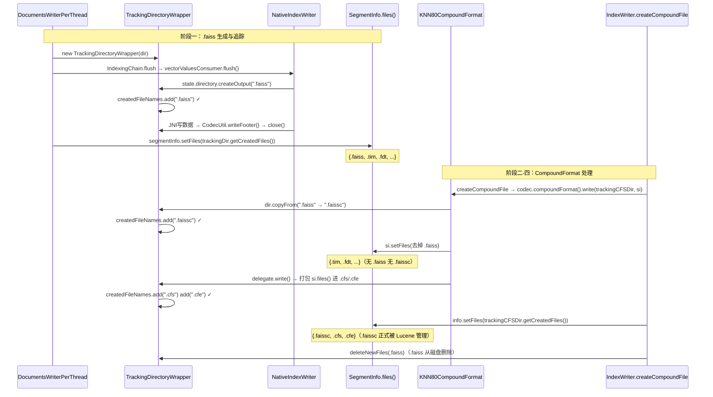

# Directory.createOutput 完整调用链分析

> 分析入口：`NativeIndexWriter.java` 中的 `state.directory.createOutput(...)` 调用。
> 追踪范围：从 Lucene flush/merge 触发，到 native 索引文件被纳入 Lucene segment 管理的完整链路。

---

## 调用链总览（Mermaid 时序图）



---

## 逐层调用详情（含文件 & 行号）

### 第 1 层：Lucene Flush / Merge 触发

| 调用 | 文件 | 行号 |
|------|------|------|
| `flush(maxDoc, sortMap)` 入口 | `KNN990Codec/NativeEngines990KnnVectorsWriter.java` | L93 |
| `NativeIndexWriter.getWriter(...)` 获取 writer | `KNN990Codec/NativeEngines990KnnVectorsWriter.java` | L120~125 |
| `writer.flushIndex(knnVectorValuesSupplier, totalLiveDocs)` | `KNN990Codec/NativeEngines990KnnVectorsWriter.java` | L128 |
| `mergeOneField(fieldInfo, mergeState)` 入口 | `KNN990Codec/NativeEngines990KnnVectorsWriter.java` | L136 |
| `writer.mergeIndex(knnVectorValuesSupplier, totalLiveDocs)` | `KNN990Codec/NativeEngines990KnnVectorsWriter.java` | L172 |

**路径**:
```
src/main/java/org/opensearch/knn/index/codec/KNN990Codec/NativeEngines990KnnVectorsWriter.java
```

---

### 第 2 层：NativeIndexWriter — 文件创建核心

| 调用 | 文件 | 行号 |
|------|------|------|
| `flushIndex(...)` → `buildAndWriteIndex(..., isFlush=true)` | `nativeindex/NativeIndexWriter.java` | L104~106 |
| `mergeIndex(...)` → `buildAndWriteIndex(..., isFlush=false)` | `nativeindex/NativeIndexWriter.java` | L114~126 |
| `buildEngineFileName(...)` 构造引擎文件名（如 `_0_9_10.faiss`） | `nativeindex/NativeIndexWriter.java` | L137~142 |
| **`state.directory.createOutput(engineFileName, state.context)`** ← 核心调用 | `nativeindex/NativeIndexWriter.java` | **L143** |
| `new IndexOutputWithBuffer(output)` | `nativeindex/NativeIndexWriter.java` | L144 |
| `indexBuilderFactory.getBuildStrategy(...)` 获取构建策略 | `nativeindex/NativeIndexWriter.java` | L153~158 |
| `indexBuilder.buildAndWriteIndex(nativeIndexParams)` 调用策略 | `nativeindex/NativeIndexWriter.java` | L159 |
| `CodecUtil.writeFooter(output)` 写 CRC32 尾部 | `nativeindex/NativeIndexWriter.java` | L160 |

**路径**:
```
src/main/java/org/opensearch/knn/index/codec/nativeindex/NativeIndexWriter.java
```

> **注意**：`createOutput` 调用后 **没有** `CodecUtil.writeIndexHeader`。
> 引擎文件（`.faiss`）由 native 库自管格式，文件首字节即 Faiss 内置的 magic number/版本头。
> 仅在最后写 `CodecUtil.writeFooter`（CRC32 checksum）供 Lucene 完整性校验。

---

### 第 3 层：IndexOutputWithBuffer — JNI 写入缓冲桥梁

| 字段/方法 | 文件 | 行号 |
|-----------|------|------|
| `buffer` —— 64 KB 写缓冲区（供 native 层填充） | `store/IndexOutputWithBuffer.java` | L26 |
| `writeBytes(int length)` —— JNI 回调入口 | `store/IndexOutputWithBuffer.java` | L35~42 |
| `indexOutput.writeBytes(buffer, 0, length)` —— 委托给 Lucene | `store/IndexOutputWithBuffer.java` | L38 |
| `writeFromStreamWithBuffer(InputStream, int)` —— remote 回退路径 | `store/IndexOutputWithBuffer.java` | L51~53 |

**路径**:
```
src/main/java/org/opensearch/knn/index/store/IndexOutputWithBuffer.java
```

---

### 第 4 层：MemOptimizedNativeIndexBuildStrategy — 分批构建 & 写索引

| 调用 | 文件 | 行号 |
|------|------|------|
| `buildAndWriteIndex(indexInfo)` 入口 | `nativeindex/MemOptimizedNativeIndexBuildStrategy.java` | L53 |
| `JNIService.initIndex(numDocs, dim, params, engine)` 初始化索引内存 | `nativeindex/MemOptimizedNativeIndexBuildStrategy.java` | L62~68 |
| `JNIService.insertToIndex(docIds, vectorAddr, ...)` 分批插入向量 | `nativeindex/MemOptimizedNativeIndexBuildStrategy.java` | L89~99 |
| `JNIService.writeIndex(indexOutputWithBuffer, indexMemoryAddress, engine, params)` **触发写文件** | `nativeindex/MemOptimizedNativeIndexBuildStrategy.java` | **L125** |

**路径**:
```
src/main/java/org/opensearch/knn/index/codec/nativeindex/MemOptimizedNativeIndexBuildStrategy.java
```

---

### 第 5 层：JNIService → FaissService (native C++)

| 调用 | 文件 | 行号 |
|------|------|------|
| `writeIndex(output, indexAddress, knnEngine, params)` 分发入口 | `jni/JNIService.java` | L101 |
| `FaissService.writeIndex(indexAddr, output)` （float 索引） | `jni/JNIService.java` | L108 |
| `FaissService.writeBinaryIndex(indexAddr, output)` （binary 索引） | `jni/JNIService.java` | L104 |
| `FaissService.writeByteIndex(indexAddr, output)` （byte 索引） | `jni/JNIService.java` | L106 |

`FaissService` 是 `native` 方法声明类，实际执行在 C++ JNI 层：
- C++ 调用 Faiss 的 `faiss::write_index(index, writer)`
- `FaissOpenSearchIOWriter` 每次写数据就回调 Java 的 `IndexOutputWithBuffer.writeBytes(length)`

**路径**:
```
src/main/java/org/opensearch/knn/jni/JNIService.java
src/main/java/org/opensearch/knn/jni/FaissService.java  (native 声明)
jni/src/faiss_wrapper.cpp                                (C++ 实现)
```

---

### 第 6 层：KNN80CompoundFormat — 纳入 Lucene Segment 管理

Lucene `IndexWriter` 在 segment 完成后回调 `CompoundFormat.write()`，K-NN 通过 `KNN80CompoundFormat` 对引擎文件做特殊处理：

| 调用 | 文件 | 行号 |
|------|------|------|
| `write(dir, si, context)` 入口 | `KNN80Codec/KNN80CompoundFormat.java` | L48 |
| `writeEngineFiles(dir, si, ctx, ".faiss")` 处理引擎文件 | `KNN80Codec/KNN80CompoundFormat.java` | L50~51 |
| `dir.copyFrom(dir, engineFile, engineCompoundFile, ctx)` `.faiss` → `.faissc` | `KNN80Codec/KNN80CompoundFormat.java` | L67 |
| `si.setFiles(segmentFiles)` 从 si 移除原 `.faiss` | `KNN80Codec/KNN80CompoundFormat.java` | L70 |
| `delegate.write(dir, si, ctx)` 标准 Lucene 打包（`.cfs` / `.cfe`，含 Header+Footer） | `KNN80Codec/KNN80CompoundFormat.java` | L52 |

读取时，`KNN80CompoundDirectory.openInput(name, ctx)` 将对 `.faissc` 的请求路由至外部 `dir`（L47~49）。

**路径**:
```
src/main/java/org/opensearch/knn/index/codec/KNN80Codec/KNN80CompoundFormat.java
src/main/java/org/opensearch/knn/index/codec/KNN80Codec/KNN80CompoundDirectory.java
```

---

## 文件格式对比（含 Header 情况）

| 文件扩展名 | 对应格式 | 是否有 Lucene IndexHeader | 是否有 CodecFooter |
|------------|----------|--------------------------|-------------------|
| `.faiss` | Faiss native 格式（临时文件） | ❌ 没有 | ✅ 有（CRC32） |
| `.faissc` | 引擎复合格式（最终文件） | ❌ 没有（copyFrom 原样复制） | ✅ 有 |
| `.cfs` | Lucene 标准复合文件 | ✅ 有 IndexHeader | ✅ 有 |
| `.cfe` | Lucene 标准入口表 | ✅ 有 IndexHeader | ✅ 有 |
| `.qs` | 量化状态文件 | ✅ 有 IndexHeader | ✅ 有 |

---

## 关键源文件索引

```
src/main/java/org/opensearch/knn/index/codec/
├── KNN990Codec/
│   ├── NativeEngines990KnnVectorsWriter.java   # 第1层：flush/merge 入口
│   └── KNN990QuantizationStateWriter.java      # 量化状态文件（有完整 Header+Footer）
├── KNN80Codec/
│   ├── KNN80CompoundFormat.java                # 第6层：纳入 Lucene segment 管理
│   └── KNN80CompoundDirectory.java             # 读取时路由引擎文件
└── nativeindex/
    ├── NativeIndexWriter.java                  # 第2层：createOutput 调用点（L143）
    ├── NativeIndexBuildStrategy.java           # 构建策略接口
    └── MemOptimizedNativeIndexBuildStrategy.java # 第4层：JNI 调用（L125）

src/main/java/org/opensearch/knn/index/store/
└── IndexOutputWithBuffer.java                  # 第3层：64KB 缓冲桥梁（L35~42）

src/main/java/org/opensearch/knn/jni/
├── JNIService.java                             # 第5层：Java JNI 分发（L101~116）
└── FaissService.java                           # native 方法声明

jni/src/
└── faiss_wrapper.cpp                           # C++ Faiss write_index 实现
```

---

## 完整文件生命周期：从 flush/merge 到 Lucene 管理

### 阶段一：.faiss 文件的生成与追踪

**触发条件：** Lucene RAM buffer 满 → `DocumentsWriterPerThread.flush()` 被调用。

`DocumentsWriterPerThread` 构建 `SegmentWriteState` 时，传入的 `directory` 已是 `TrackingDirectoryWrapper`：

```java
// DocumentsWriterPerThread.flush()（Lucene 内部）
TrackingDirectoryWrapper trackingDir = new TrackingDirectoryWrapper(this.directory);
SegmentWriteState state = new SegmentWriteState(infoStream, trackingDir, segmentInfo, ...);

// IndexingChain.flush(state)
//   → vectorValuesConsumer.flush(state)
//     → NativeEngines990KnnVectorsWriter.flush()
//       → NativeIndexWriter.buildAndWriteIndex()
//         → state.directory.createOutput(".faiss")  ← TrackingDirectoryWrapper 记录 .faiss
//         → JNI 写数据 → CodecUtil.writeFooter()

// 所有 codec flush 完成后：
segmentInfo.setFiles(trackingDir.getCreatedFiles());
// → {_0.faiss, _0.tim, _0.fdt, ...} 全部注册进 SegmentInfo
```

> **关键：** `createOutput` 本身不注册文件到 `SegmentInfo`。  
> `TrackingDirectoryWrapper` 拦截每个 IO 操作追踪文件名，flush 结束后统一 `setFiles` 注册。

**TrackingDirectoryWrapper 追踪原理（源码）：**

```java
// 创建文件 → 记录（NativeIndexWriter.createOutput 走这里）
public IndexOutput createOutput(String name, IOContext context) throws IOException {
    IndexOutput output = in.createOutput(name, context);
    createdFileNames.add(name);    // ← .faiss 在此被记录
    return output;
}

// copy 文件 → 记录目标文件名（KNN80CompoundFormat 走这里）
public void copyFrom(Directory from, String src, String dest, IOContext context) throws IOException {
    in.copyFrom(from, src, dest, context);  // 委托 MMapDirectory 实际执行：
    //   from.openInput(src) → 内存映射读取 .faiss
    //   createOutput(dest)  → 磁盘创建 .faissc
    //   os.copyBytes(is)    → 字节流 1:1 复制
    createdFileNames.add(dest);    // ← .faissc 在此被记录
}

// 删除文件 → 移除记录
public void deleteFile(String name) throws IOException {
    in.deleteFile(name);
    createdFileNames.remove(name);
}
```

---

### 阶段二：CompoundFormat.write() 的触发时机

| 路径 | 决策依据 | 调用点 |
|------|---------|--------|
| **Flush**（新 segment） | `IndexWriterConfig.getUseCompoundFile()`，默认 `true` | `IndexWriter.publishFlushedSegment()` → `createCompoundFile()` |
| **Merge**（合并 segment） | `codec.compoundFormat().useCompoundFile(size, mergePolicy)` 基于 `noCFSRatio`/`maxCFSSegmentSizeMB` | `IndexWriter.mergeMiddle()` → `createCompoundFile()` |

`IndexWriter.createCompoundFile()` 是最终触发点：

```java
static void createCompoundFile(InfoStream infoStream, TrackingDirectoryWrapper directory,
                                SegmentInfo info, IOContext context, ...) throws IOException {
    // 传入的 directory 是新建的 TrackingDirectoryWrapper（只追踪 compound 阶段新增文件）
    info.getCodec().compoundFormat().write(directory, info, context);
    //                              ↑ 调用 KNN80CompoundFormat.write()
    // write() 返回后，注册所有 compound 阶段新增文件：
    info.setFiles(new HashSet<>(directory.getCreatedFiles()));
}
```

---

### 阶段三：.faiss 被排除，.faissc 被追踪但不在 .cfs 内部

**执行顺序是关键**：

```
KNN80CompoundFormat.write(trackingCFSDir, si, ctx)
│
├─► writeEngineFiles(trackingCFSDir, si, ctx, ".faiss")
│     ├─► trackingCFSDir.copyFrom(".faiss" → ".faissc")
│     │     └─► createdFileNames.add(".faissc")  ← 追踪 ✓
│     └─► si.setFiles(去掉 .faiss)
│           → si.files() = {.tim, .fdt, ...}    ← .faissc 从未进入 si.files()
│
└─► delegate.write(trackingCFSDir, si, ctx)      ← Lucene50CompoundFormat
      → 只打包 si.files() 里的文件 = {.tim, .fdt, ...}
      → .faissc 不在 si.files() → ❌ 不被打进 .cfs 内部
      → .cfs/.cfe 被 trackingCFSDir 记录
```

**为什么 .faissc 不能进 .cfs？**  
`.cfs` 要求内部每个文件都有标准 Lucene IndexHeader+Footer。`.faissc` 是 Faiss native 格式（自有 magic/版本头），没有 IndexHeader，无法通过 Lucene 的完整性校验。

---

### 阶段四：.faissc 被 Lucene 正式接管

`KNN80CompoundFormat.write()` 返回后，`createCompoundFile` 执行：

```java
info.setFiles(new HashSet<>(directory.getCreatedFiles()));
// directory.getCreatedFiles() = { "_0.faissc", "_0.cfs", "_0.cfe" }
// ↑ .faissc 正式进入 SegmentInfo.files()，Lucene 从此接管
```

接管后的保障机制：

| 机制 | 作用 |
|------|------|
| `IndexFileDeleter` | 对 `.faissc` 引用计数，防止提前删除 |
| `checkpoint()` | 将含 `.faissc` 的 SegmentInfo 写入临时 `segments_N` |
| `directory.sync()` | commit 前 fsync，确保 `.faissc` 持久化到磁盘 |
| `segments_N` 提交 | commit 后对 Reader 可见 |

原始 `.faiss` 在 `createCompoundFile` 成功后，由 `deleteNewFiles(filesToRemove)` 删除（不再被引用）。

---

### 完整生命周期时序图


