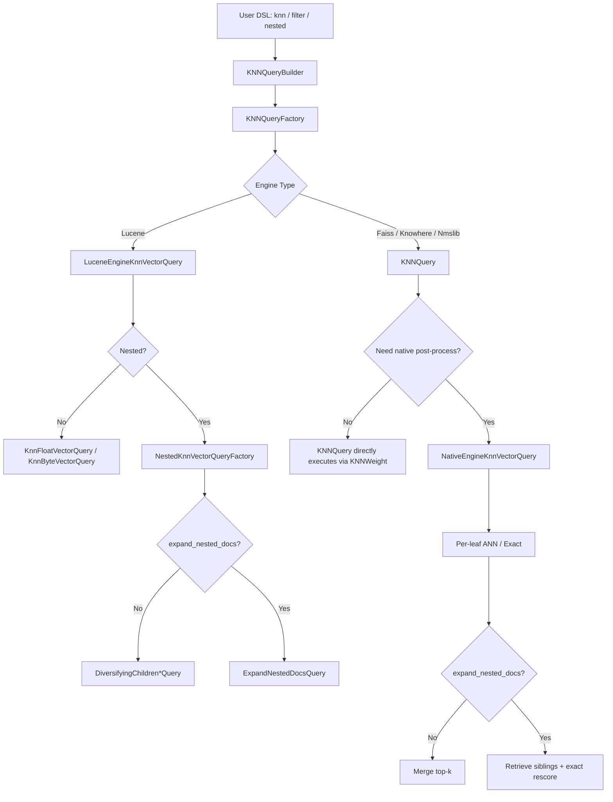
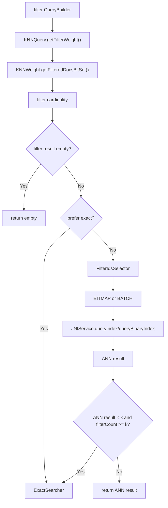
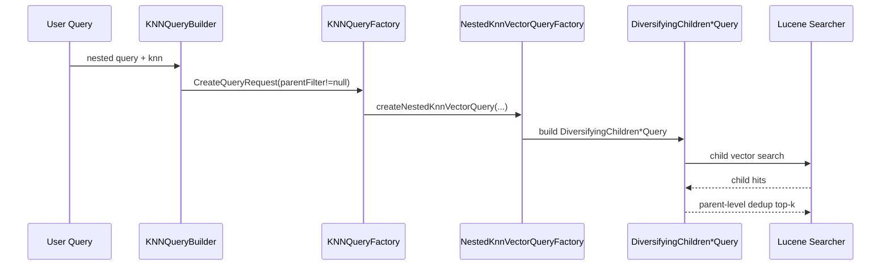
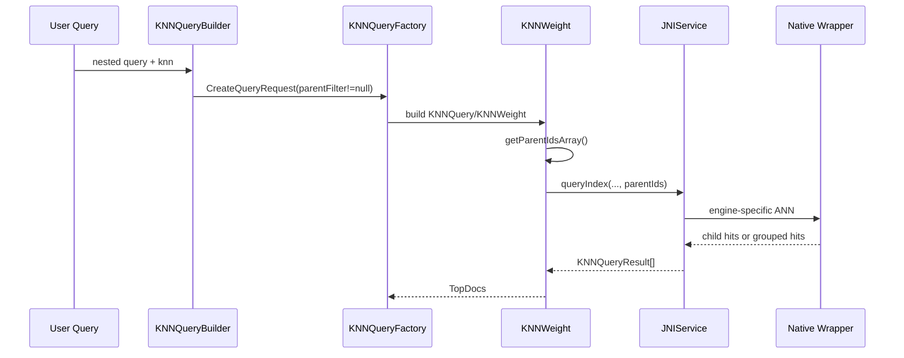
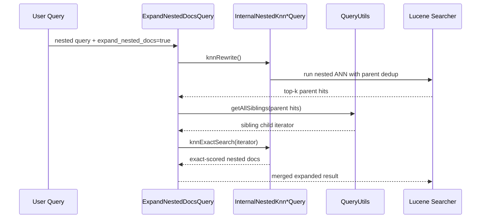
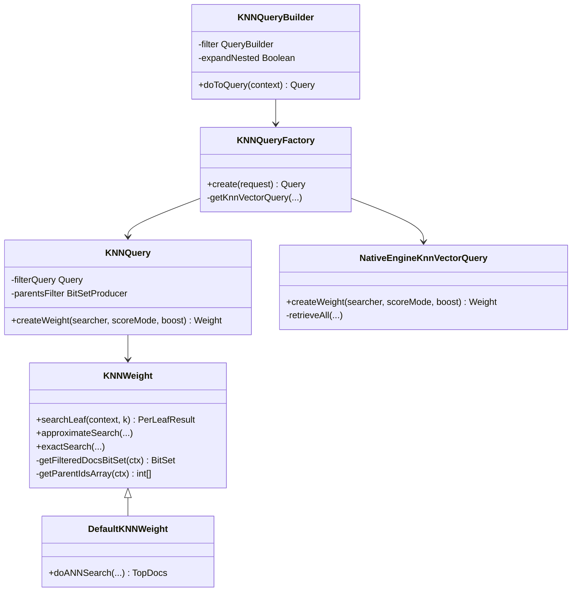
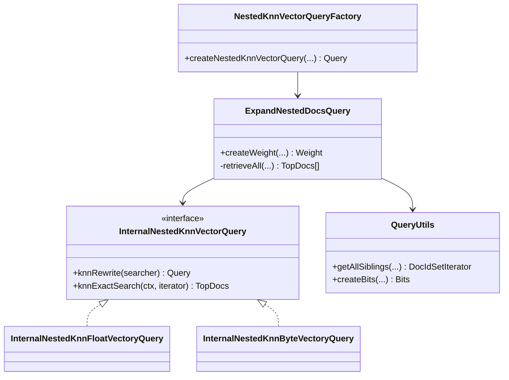
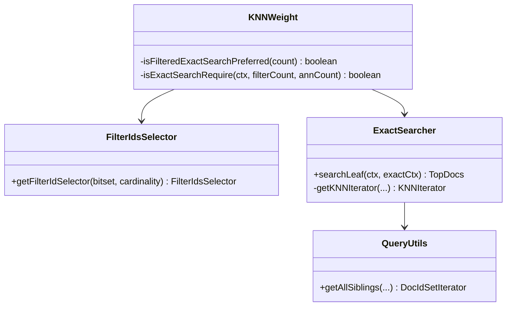

# k-NN Filter 与 Nested Search 实现设计

> 目标：整理当前项目中 `filter`、`nested search` 以及两者组合场景的真实实现路径，说明不同引擎的差异，并给出可用于评审和后续演进的架构图、类图与时序图。
>
> 说明：本文描述的是当前代码实现，而不是理想化方案。若实现与对外能力声明存在偏差，以代码路径和测试为准。

---

## 1. 范围与结论

本文覆盖以下能力：

- `knn` 查询中的 `filter`
- `nested` 场景下的 k-NN 查询
- `expand_nested_docs=true` 的 nested 扩展行为
- `filter + nested` 组合查询
- `Lucene`、`Faiss`、`Knowhere`、`Nmslib` 的实现差异

核心结论如下：

- 查询统一从 `KNNQueryBuilder -> KNNQueryFactory` 进入，再根据引擎分为 `Lucene engine` 路径和 `native engine` 路径。
- `filter` 的统一抽象是“先得到 segment 级过滤 doc 集合，再决定 exact / ANN 的执行方式”。
- `nested search` 的统一抽象是“先在 child vector 上召回，再按 parent 去重”；如果开启 `expand_nested_docs`，还会在 parent 确定后回捞 sibling nested docs。
- `Lucene` 的 nested/filter 主要依赖 Lucene 原生查询能力。
- `Faiss` 的 nested/filter 主要通过 JNI 将过滤集合和 parent 分组信息直接下推给底层搜索参数。
- `Knowhere` 也支持 filter/nested，但实现风格和 Faiss 不同，更依赖 wrapper 层做 `external_id/internal_id` 映射以及结果折叠。
- `Nmslib` 已废弃，且不在过滤/嵌套支持集合中。

---

## 2. 术语

- `filter query`
  - 用户在 `knn` 子句中传入的 `filter`
  - 最终会被改写为 Lucene `Query`

- `filterWeight`
  - `filter query` 经过 `rewrite + createWeight` 后得到的 Lucene `Weight`
  - 用于在每个 segment 上生成过滤 doc 集合

- `filter bitset`
  - 某个 leaf/segment 内满足过滤条件的 docID 集合
  - 在 native engine 下会进一步编码为 JNI 可消费的过滤参数

- `parentFilter`
  - OpenSearch nested query context 提供的 parent-child 映射
  - 只要它存在，k-NN 层就将查询视为 nested query

- `expand_nested_docs`
  - 表示最终返回的不仅是“每个 parent 的最佳 child”，而是要把命中 parent 下对应的 nested docs 一并展开

- `exact search`
  - 不走 native ANN 图搜索，而是直接遍历候选 doc 集合并计算真实相似度

- `ANN search`
  - 走底层图搜索或向量检索近似算法

---

## 3. 顶层逻辑

### 3.1 统一入口

所有 `knn` 查询最终都会进入：

- `org.opensearch.knn.index.query.KNNQueryBuilder`
- `org.opensearch.knn.index.query.KNNQueryFactory`

顶层流程如下：

1. `KNNQueryBuilder#doToQuery()` 读取 mapping、engine、space type、vector type、query 参数。
2. 校验当前引擎是否支持 `filter`、`radial search`、`expand_nested_docs` 等能力。
3. 组装 `CreateQueryRequest`。
4. `KNNQueryFactory#create()` 根据引擎类型选择：
   - `LuceneEngineKnnVectorQuery`
   - `KNNQuery`
   - `NativeEngineKnnVectorQuery`

### 3.2 顶层架构图

### 3.3 代码入口

- 查询构建：
  - `src/main/java/org/opensearch/knn/index/query/KNNQueryBuilder.java`
  - `src/main/java/org/opensearch/knn/index/query/KNNQueryFactory.java`
- 引擎能力声明：
  - `src/main/java/org/opensearch/knn/index/engine/KNNEngine.java`

---

## 4. Filter 逻辑实现

## 4.1 DSL 到过滤查询对象

`filter` 在解析阶段只是 `KNNQueryBuilder` 的一个普通字段：

- `KNNQueryBuilderParser` 负责从 DSL 读出 `filter`
- `KNNQueryBuilder` 将其保存为 `QueryBuilder`
- `KNNQueryFactory` 再把它转换为 Lucene `Query`

在构建 native query 时，filter 不是直接下推给 JNI，而是先变成 Lucene 层可执行的 `Weight`。

### 4.1.1 为什么要先经过 Lucene Weight

原因是 native engine 需要知道“当前 segment 里哪些 docID 可以参与 ANN 搜索”，而这本质上是 Lucene filter 的执行结果。  
因此当前设计不是把 DSL filter 直接翻译成 native engine 的表达式，而是：

1. 用 Lucene 执行 filter
2. 得到 segment 内的 doc 集合
3. 再把 doc 集合压缩成 native engine 可消费的过滤参数

---

## 4.2 Native Engine 下的过滤执行链

在 native engine 中，`KNNQuery#createWeight()` 会构造 `filterWeight`：

- 若有 `filterQuery`
  - 会包装成：
    - `filterQuery`
    - `FieldExistsQuery(vectorField)`
- 然后做 `rewrite + createWeight`

这样做的作用是保证：

- 过滤结果只包含满足 filter 的 doc
- 且这些 doc 必须真的存在向量字段

### 4.2.1 每个 segment 的过滤 bitset

`KNNWeight#searchLeaf()` 是 native 查询的核心入口。  
它在每个 leaf 上先调用 `getFilteredDocsBitSet()`：

1. 读取 `filterWeight.scorer(ctx)`
2. 将 scorer iterator 转成 `BitSet`
3. 与 live docs 联合过滤

如果某个 segment 的过滤结果是空，直接返回空结果，不进入 JNI。

### 4.2.2 exact 与 ANN 的决策

当前实现不是“只要有 filter 就一定走 ANN”。  
`KNNWeight#searchLeaf()` 会根据过滤结果规模决定策略：

1. 如果 `filterCount <= k`
   - 直接走 exact search
2. 如果设置了 `index.knn.advanced.filtered_exact_search_threshold`
   - 且阈值大于等于过滤结果数
   - 直接走 exact search
3. 如果没有显式阈值
   - 则用默认 `MAX_DISTANCE_COMPUTATIONS` 估算 exact 成本
   - 成本可接受则走 exact search
4. 否则进入 ANN

进入 ANN 后还有一次 fallback：

- 如果 ANN 返回结果数 `< k`
- 但过滤命中数其实 `>= k`
- 说明 ANN 召回不够
- 则回退到 exact search

因此过滤路径本质是：

- 小候选集优先 exact
- 大候选集优先 ANN
- ANN 不足时回退 exact

### 4.2.3 FilterIdsSelector

ANN 前，过滤 bitset 会被编码成 JNI 可下推的结构：

- `BITMAP`
  - 过滤较稠密时使用
  - 直接传位图
- `BATCH`
  - 过滤较稀疏时使用
  - 传 docID 数组

这是为了在 JNI/native 层平衡：

- 传输体积
- 构造成本
- 查询时的 membership 检查成本

### 4.2.4 Native filter 流程图

---

## 4.3 Lucene Engine 下的过滤

Lucene engine 的过滤路径更直接：

- 非 nested 情况下，直接构造：
  - `KnnFloatVectorQuery(field, vector, k, filterQuery)`
  - 或 `KnnByteVectorQuery(...)`

也就是说，Lucene filter 不是先转 bitset 再下推 JNI，而是直接由 Lucene 原生向量查询消费。

在 nested 情况下，filter 也仍然保留在 Lucene query 层，由 nested query 实现处理。

---

## 4.4 Filter 的代码责任划分

| 层次 | 责任 |
|---|---|
| `KNNQueryBuilder` | 解析 filter 并校验引擎能力 |
| `KNNQuery` | 将 filter query 包装为 filterWeight |
| `KNNWeight` | 在 leaf 上执行 filter，生成 bitset，并决定 exact / ANN |
| `FilterIdsSelector` | 将 bitset 编码成 JNI 可接受的过滤表示 |
| `JNIService` | 根据引擎把过滤参数转发到 Faiss / Knowhere |
| `Faiss/Knowhere wrapper` | 在 native 底层真正执行过滤 |

---

## 5. Nested Search 逻辑实现

## 5.1 Nested 的识别方式

当前实现里，k-NN 插件本身并不手工解析顶层 DSL 的 `nested` 结构。  
它依赖 `QueryShardContext` 提供的 `parentFilter` 来判断当前查询是否处于 nested context。

只要：

- `context.getParentFilter() != null`

就把查询视为 nested query。

这意味着 nested 的“外层上下文组织”仍然由 OpenSearch/Lucene nested query 机制负责，k-NN 插件只消费已建立好的 parent-child 关系。

---

## 5.2 Nested 的统一语义

无论 Lucene 还是 native engine，nested k-NN 的目标语义都一致：

1. 真正参与向量检索的是 nested child doc
2. 但最终 top-k 的语义是 parent 级别
3. 同一个 parent 下多个 child 命中时，只保留一个 parent 结果

因此 nested search 的关键不是“怎么搜索向量”，而是“怎么做 parent-level collapse / dedup”。

---

## 5.3 Lucene Engine 下的 Nested

Lucene engine 下，nested 主要依赖 Lucene 自带能力：

- `DiversifyingChildrenFloatKnnVectorQuery`
- `DiversifyingChildrenByteKnnVectorQuery`

这两个 query 的职责是：

- 在 child vector 上做向量搜索
- 结果按 parent 去重
- 最终返回 parent 语义的 top-k

如果 `expand_nested_docs=false`，这是完整主路径。

### 5.3.1 Lucene Nested 构造过程

`KNNQueryFactory#getKnnVectorQuery()` 检测到 `parentFilter != null` 后，会调用：

- `NestedKnnVectorQueryFactory#createNestedKnnVectorQuery()`

其中：

- 普通 nested
  - 直接返回 `DiversifyingChildren*Query`
- `expand_nested_docs=true`
  - 返回 `ExpandNestedDocsQuery`

### 5.3.2 Lucene Nested 时序图

---

## 5.4 Native Engine 下的 Nested

native engine 不能直接复用 Lucene 的 `DiversifyingChildren*Query`。  
它的实现方式是：

1. Java 层从 `parentFilter` 中提取 parent docID 数组
2. 将该数组通过 JNI 下推到底层引擎
3. 底层引擎在 ANN 结果上做 parent 级折叠

### 5.4.1 Java 层 parentIds 提取

`KNNWeight#getParentIdsArray()` 会把 `parentFilter.getBitSet(context)` 转换为 `int[] parentIds`。

这里默认依赖 OpenSearch nested docID 的布局约定：

- child docID 排在前面
- parent docID 排在该组 child 之后
- 同一 parent 的 child 与 parent 在 docID 上是局部连续关系

底层引擎再利用这个 parentIds 数组完成 child -> parent 的映射或分组。

### 5.4.2 Faiss 的 Nested

Faiss 通过 JNI wrapper 构造 `IDGrouperBitmap`：

- 如果是 HNSW 查询
  - `SearchParametersHNSW.grp = idGrouper`
- 如果存在 filter
  - 同时再挂 `IDSelector`

所以 Faiss 的 nested 和 filter 是底层搜索参数级别的组合：

- `sel`: 过滤允许集合
- `grp`: parent 分组折叠

这是一种比较“原生”的实现方式。

### 5.4.3 Knowhere 的 Nested

Knowhere 的 nested 风格和 Faiss 不同。

它不是把 parent 分组直接交给底层索引结构，而是在 wrapper 层完成：

1. 如果有 `parentIds`
   - 先把搜索请求的 `TOPK` 放大到：
     - 全量 vector 数
     - 或过滤后允许的 vector 数
2. 调用 knowhere 搜索
3. wrapper 层把 returned internal ids 映射成 external docID
4. 再根据 `parentIds` 计算 parent docID
5. 用 `seen_parents` 去重
6. 截断回请求的 `k`

换句话说：

- Faiss: 查询阶段原生支持 parent grouping
- Knowhere: 查询后在 wrapper 层做 parent collapse

这是两者最重要的 nested 实现差异之一。

### 5.4.4 Native Nested 时序图

---

## 6. expand_nested_docs 实现

## 6.1 语义

默认 nested k-NN 的结果是：

- 每个 parent 只返回一个代表性 child

但某些场景下，用户希望：

- top-k parent 确定后
- 把这些 parent 下符合条件的 nested docs 都返回出来

这就是 `expand_nested_docs=true`。

当前实现里，它并不是“原地把 ANN 结果改大”，而是一个显式的二阶段流程：

1. 第一阶段先确定 parent top-k
2. 第二阶段再回捞 sibling nested docs
3. 对 sibling 重新做 exact 打分

---

## 6.2 Lucene 下的 expand_nested_docs

Lucene 下使用 `ExpandNestedDocsQuery`：

1. 调用内部 nested query 先完成 top-k parent 检索
2. 在每个 leaf 上收集命中 parent 对应的 child docID
3. 通过 `QueryUtils#getAllSiblings()` 找到所有 sibling nested docs
4. 用 `InternalNestedKnn*Query#knnExactSearch()` 对这些 sibling 做 exact knn
5. 合并结果，返回 expanded nested docs

这是一条典型的：

- `ANN parent recall`
- `exact sibling expansion`

二阶段路径。

### 6.2.1 Lucene expand 时序图

---

## 6.3 Native 下的 expand_nested_docs

native engine 没有直接复用 `ExpandNestedDocsQuery`，但语义上和 Lucene 非常接近。

`NativeEngineKnnVectorQuery#createWeight()` 在完成 per-leaf top-k 后：

1. 如果 `expandNestedDocs=true`
2. 对每个 leaf 调用 `retrieveLeafResult()`
3. 基于当前 parent 命中结果，通过 `QueryUtils#getAllSiblings()` 找 sibling
4. 构造 `ExactSearcherContext`
5. 调用 `knnWeight.exactSearch()` 重新对 sibling 计算得分
6. 返回 expanded nested docs

因此 Native 的 expand 也是二阶段：

- 第一阶段：native ANN / exact 得到 parent hits
- 第二阶段：Java exact search 回捞 sibling nested docs

---

## 7. Filter + Nested 组合路径

## 7.1 组合语义

`filter + nested` 本质上有两层语义：

1. 哪些 child vector 可参与检索
2. 检索结果如何折叠成 parent

这两者并不冲突，因此实现中它们是并行生效的：

- `filter`
  - 控制候选 doc 集合
- `parentIds / parentFilter`
  - 控制 parent collapse

---

## 7.2 Faiss 的组合方式

Faiss 在同一次 JNI 查询里同时传入：

- `filteredIds`
- `filterIdsType`
- `parentIds`

在 HNSW 路径中：

- `IDSelector`
  - 负责 filter
- `IDGrouperBitmap`
  - 负责 nested parent 分组

它们在同一组搜索参数中协同生效。

---

## 7.3 Knowhere 的组合方式

Knowhere 组合路径的关键点有两个：

1. `BuildFilterState`
   - 先基于 `external_id/internal_id` 映射构造允许集合
2. `TranslateSearchResults`
   - 再基于 `parentIds` 把 child 结果折叠成 parent 级 top-k

此外，为了保证 nested 场景去重后仍有足够候选：

- wrapper 会把 native `TOPK` 提升到允许 doc 数量级

因此 Knowhere 的组合路径更偏“wrapper 层二次加工”。

---

## 8. Exact Search 在过滤和嵌套中的作用

`ExactSearcher` 是整个设计里的关键兜底与二阶段组件。

它承担三类工作：

1. 过滤结果较小时，直接替代 ANN
2. ANN 在过滤场景下召回不足时做 fallback
3. `expand_nested_docs` 时对 sibling nested docs 做重新打分

### 8.1 ExactSearcher 的 nested 适配

`ExactSearcher#getKNNIterator()` 会根据场景选择不同 iterator：

- 普通场景：
  - `VectorIdsKNNIterator`
  - `ByteVectorIdsKNNIterator`
  - `BinaryVectorIdsKNNIterator`
- nested 场景：
  - `NestedVectorIdsKNNIterator`
  - `NestedByteVectorIdsKNNIterator`
  - `NestedBinaryVectorIdsKNNIterator`

所以 exact search 自身已经具备：

- 过滤子集打分
- nested parent-child 关系处理

这也是它能在多条路径中复用的原因。

---

## 9. 类图

## 9.1 顶层查询类图

## 9.2 Lucene Nested 相关类图

## 9.3 Filter / Exact Search 相关类图

---

## 10. 引擎差异总表

| 能力 | Lucene | Faiss | Knowhere | Nmslib |
|---|---|---|---|---|
| filter 支持 | 支持 | 支持 | 支持 | 不支持 |
| nested 支持 | 支持 | 支持 | 支持 | 不在支持集合中 |
| `expand_nested_docs` | 支持 | 支持 | 支持 | 依赖特殊处理，不是正式主路径 |
| filter 执行层 | Lucene 原生 query | Java bitset -> JNI `IDSelector` | Java bitset -> wrapper `BitsetView` | 无 |
| nested 去重层 | Lucene `DiversifyingChildren*Query` | Faiss `IDGrouperBitmap` | Knowhere wrapper 后处理 | 无正式实现 |
| filter + nested 组合 | Lucene query 原生组合 | 同一次 JNI 下推 `sel + grp` | wrapper 先过滤后折叠 | 无 |
| radial search | 支持 | 支持 | 不支持 | 不支持 |

---

## 11. 关键代码路径

## 11.1 查询构建

- `src/main/java/org/opensearch/knn/index/query/KNNQueryBuilder.java`
- `src/main/java/org/opensearch/knn/index/query/parser/KNNQueryBuilderParser.java`
- `src/main/java/org/opensearch/knn/index/query/KNNQueryFactory.java`

## 11.2 Native filter / nested

- `src/main/java/org/opensearch/knn/index/query/KNNQuery.java`
- `src/main/java/org/opensearch/knn/index/query/KNNWeight.java`
- `src/main/java/org/opensearch/knn/index/query/DefaultKNNWeight.java`
- `src/main/java/org/opensearch/knn/index/query/FilterIdsSelector.java`
- `src/main/java/org/opensearch/knn/jni/JNIService.java`

## 11.3 Lucene nested / expand

- `src/main/java/org/opensearch/knn/index/query/lucenelib/NestedKnnVectorQueryFactory.java`
- `src/main/java/org/opensearch/knn/index/query/lucenelib/ExpandNestedDocsQuery.java`
- `src/main/java/org/opensearch/knn/index/query/common/QueryUtils.java`

## 11.4 Exact search

- `src/main/java/org/opensearch/knn/index/query/ExactSearcher.java`

## 11.5 Native wrappers

- `jni/src/faiss_wrapper.cpp`
- `jni/src/knowhere_wrapper.cpp`

---

## 12. 测试覆盖

以下测试是理解当前语义最直接的入口：

### 12.1 Filter

- `src/test/java/org/opensearch/knn/integ/FilteredSearchANNSearchIT.java`
- `src/test/java/org/opensearch/knn/integ/FilteredSearchByteIT.java`
- `src/test/java/org/opensearch/knn/integ/FilteredSearchBinaryIT.java`
- `src/test/java/org/opensearch/knn/index/AdvancedFilteringUseCasesIT.java`

### 12.2 Nested

- `src/test/java/org/opensearch/knn/integ/NestedSearchIT.java`
- `src/test/java/org/opensearch/knn/integ/NestedSearchByteIT.java`
- `src/test/java/org/opensearch/knn/integ/NestedSearchBinaryIT.java`

### 12.3 Expand Nested Docs

- `src/test/java/org/opensearch/knn/integ/ExpandNestedDocsIT.java`

### 12.4 Knowhere 专项

- `src/test/java/org/opensearch/knn/index/knowhere/KnowhereFilterAndNestedIT.java`

---

## 13. 当前实现特点与后续关注点

### 13.1 当前实现特点

- Lucene 路径更“原生”，大量复用 Lucene 现成能力。
- Native 路径更“插件化”，先在 Java 侧拿到 filter bitset，再下推到底层引擎。
- `ExactSearcher` 是贯穿过滤、小候选集、nested expand、ANN fallback 的统一兜底组件。
- `Knowhere` 相比 `Faiss`，在 wrapper 层承担了更多语义补偿工作，尤其是：
  - `external/internal id` 映射
  - filter bitset 适配
  - nested parent collapse

### 13.2 值得继续关注的点

- `Knowhere` 的 nested/filter 语义虽然已接上，但复杂度更集中在 wrapper 层，后续维护成本会高于 Faiss。
- `Nmslib` 已废弃，不建议继续作为 filter/nested 语义基线。
- `expand_nested_docs` 当前天然是二阶段流程，性能分析时应单独考虑 sibling expansion 的 exact search 成本。
- `FilterIdsSelector` 目前主要基于空间占用做决策，未来若需要进一步优化延迟，可能需要引入更精细的启发式策略。

---

## 14. 参考代码定位

以下代码位置最值得结合本文一起阅读：

- 查询总入口：
  - `KNNQueryBuilder#doToQuery`
  - `KNNQueryFactory#create`
- Native filter 决策：
  - `KNNWeight#searchLeaf`
  - `KNNWeight#isFilteredExactSearchPreferred`
  - `KNNWeight#isExactSearchRequire`
- Native 下推：
  - `DefaultKNNWeight#doANNSearch`
  - `JNIService#queryIndex`
- Lucene nested：
  - `NestedKnnVectorQueryFactory`
  - `ExpandNestedDocsQuery`
- Native nested：
  - `KNNWeight#getParentIdsArray`
  - `NativeEngineKnnVectorQuery#retrieveLeafResult`
  - `faiss_wrapper.cpp`
  - `knowhere_wrapper.cpp`

