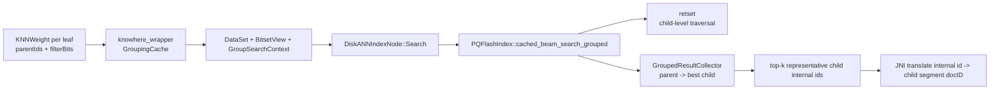
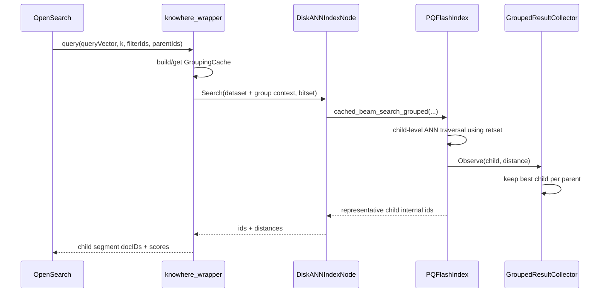

# Knowhere DiskANN Nested Search Design

## 1. Goal

This document describes a complete implementation plan for adding nested search to Knowhere DiskANN in the current `k-NN` project.

The design follows the current Faiss approach as closely as possible:

- keep graph traversal child-level
- push grouping into the native result layer
- do not inflate `topk` in the JNI wrapper
- allow returning fewer than `k` parent hits under a fixed ANN budget
- keep `expand_nested_docs` in the existing second-stage exact expansion path

This document also includes a step-by-step execution plan. Each step has unit-test validation, and the last step has end-to-end verification.

## 2. Non-goals

This version does not try to solve every nested recall issue in one step.

- It does not introduce parent-aware frontier pruning.
- It does not add "continue with larger search budget" logic.
- It does not add grouped exact fallback.
- It does not change the current DiskANN child-level stop condition.

Those can be follow-up phases after the Faiss-style grouped result path is in place and verified.

## 3. Current Problem

The current Knowhere nested search implementation in OpenSearch works like this:

- OpenSearch passes `parentIds` into JNI.
- The Knowhere wrapper expands `topk` to `allowed_count` or all vectors for nested search.
- Knowhere returns child-level ANN results.
- The wrapper deduplicates by parent after search.

Current implementation points:

- [jni/src/knowhere_wrapper.cpp](./jni/src/knowhere_wrapper.cpp)
- nested `topk` inflation: [jni/src/knowhere_wrapper.cpp](./jni/src/knowhere_wrapper.cpp)
- result dedup after search: [jni/src/knowhere_wrapper.cpp](./jni/src/knowhere_wrapper.cpp)

This has two major problems:

- performance is poor because nested search is implemented as oversample plus wrapper dedup
- result semantics are not aligned with the actual search target, which is top-k unique parents rather than top-k child vectors

## 4. Faiss Reference Model

Faiss already has the shape we want.

- `sel` filters which child ids are eligible for results
- `grp` maps child ids to parent groups
- grouped search is implemented in the native result handler, not in the wrapper
- HNSW candidate traversal is still child-level

Important reference files:

- group id API: [jni/external/faiss/faiss/impl/IDGrouper.h](./jni/external/faiss/faiss/impl/IDGrouper.h)
- bitmap implementation: [jni/external/faiss/faiss/impl/IDGrouper.cpp](./jni/external/faiss/faiss/impl/IDGrouper.cpp)
- grouped result handler: [jni/external/faiss/faiss/impl/ResultHandler.h](./jni/external/faiss/faiss/impl/ResultHandler.h)
- HNSW search entry: [jni/external/faiss/faiss/IndexHNSW.cpp](./jni/external/faiss/faiss/IndexHNSW.cpp)
- HNSW traversal loop: [jni/external/faiss/faiss/impl/HNSW.cpp](./jni/external/faiss/faiss/impl/HNSW.cpp)
- JNI wiring: [jni/src/faiss_wrapper.cpp](./jni/src/faiss_wrapper.cpp)

Faiss behavior contract that we intentionally reuse:

- `grp` only affects the result heap
- traversal candidates are still child-level
- if the fixed ANN budget only reaches `m < k` unique parents, the result length is `m`

## 5. Target Behavior in Knowhere

The target behavior for Knowhere DiskANN v1 is:

- search graph remains child-level
- `retset` remains the child-level ANN candidate pool
- parent grouping is moved into a native grouped result collector
- wrapper-level parent dedup is removed
- wrapper-level nested `topk` inflation is removed
- `expand_nested_docs=true` still uses the existing Java-side second-stage exact expansion

Result contract:

- returned hits are representative child docs
- no two returned hits belong to the same parent
- result size may be smaller than `k` under the current `search_list_size` and `beamwidth`

## 6. Architecture





## 7. Data Model

### 7.1 Nested block semantics

For nested documents, Lucene stores:

- child nested docs first
- then the parent root doc

Example inside one segment:

```text
docID=120 child A.chunk0
docID=121 child A.chunk1
docID=122 parent A

docID=123 child B.chunk0
docID=124 child B.chunk1
docID=125 parent B
```

### 7.2 ID assumptions and invariants

This design depends on a specific id model. It is important to make that explicit:

- `parentIds` passed from OpenSearch into JNI are segment-local Lucene docIDs, not business `_id` values and not global docIDs
- child doc ids used by Knowhere are also segment-local Lucene docIDs
- the mapping is only valid for native Lucene/OpenSearch nested blocks, not for arbitrary application-level `parent_id` fields

The parent ids come from the per-leaf parent bitset in [src/main/java/org/opensearch/knn/index/query/KNNWeight.java](./src/main/java/org/opensearch/knn/index/query/KNNWeight.java).

The JNI-side grouping cache assumes the standard nested block ordering:

- child docs appear before their parent doc in the same segment
- therefore a child doc resolves to the first parent docID that is `>= child_doc_id`

That logic is implemented in [jni/include/knowhere_grouping_util.h](./jni/include/knowhere_grouping_util.h).

There is one additional sidecar ordering invariant:

- `internal_to_external` must be sorted by child segment docID

This is required because `BuildGroupingCache(...)` performs a single linear scan across:

- sorted child segment docIDs from `internal_to_external`
- sorted parent segment docIDs from `parentIds`

The current build path satisfies that invariant because the native index builder collects doc ids from `knnVectorValues.docId()` in iteration order, see [src/main/java/org/opensearch/knn/index/codec/nativeindex/DefaultIndexBuildStrategy.java](./src/main/java/org/opensearch/knn/index/codec/nativeindex/DefaultIndexBuildStrategy.java).

If any of these assumptions are broken, the grouped nested mapping is not valid and the JNI side must fail fast rather than silently grouping to the wrong parent.

### 7.3 DiskANN indexed ids

Knowhere DiskANN indexes only child vectors.

Example:

```text
internal id 0 -> child segment docID 120
internal id 1 -> child segment docID 121
internal id 2 -> child segment docID 123
internal id 3 -> child segment docID 124
```

Current sidecar already stores:

```cpp
std::vector<int64_t> internal_to_external;
```

### 7.4 New grouping structures

OpenSearch JNI side:

```cpp
struct GroupingCache {
    std::vector<int64_t> parent_segment_doc_ids;
    std::vector<uint32_t> internal_to_parent_ord;
    uint64_t cache_key;
};
```

Knowhere side:

```cpp
namespace knowhere::group_search {

struct Context {
    const uint32_t* internal_to_parent_ord;
    uint32_t parent_count;
};

}
```

Meaning:

- `parent_segment_doc_ids[parent_ord] = parent segment docID`
- `internal_to_parent_ord[internal_id] = parent_ord`

This is the Knowhere equivalent of Faiss `grp`.

## 8. Code Changes

### 8.1 OpenSearch `k-NN` repo

Files to change:

- `jni/src/knowhere_wrapper.cpp`
- `jni/tests/knowhere_wrapper_test.cpp`
- optional new focused JNI unit test file for grouping cache

Required changes:

- add `GroupingCache` to `LoadedKnowhereIndex`
- build `internal_to_parent_ord` from `internal_to_external + parentIds`
- attach `group_search::Context` to query `DataSet`
- remove nested `topk` inflation logic
- remove wrapper-level parent dedup from translated results

### 8.2 Knowhere repo

Files to change:

- `knowhere/include/knowhere/dataset.h`
- new file `knowhere/include/knowhere/group_search.h`
- `knowhere/src/index/diskann/diskann.cc`
- `knowhere/thirdparty/DiskANN/include/diskann/pq_flash_index.h`
- `knowhere/thirdparty/DiskANN/src/pq_flash_index.cpp`
- tests under `knowhere/tests/ut/`

Required changes:

- add const `DataSet::Get<T>(...)`
- add `group_search::Context`
- add grouped DiskANN search entry points
- replace `full_retset` with grouped result collector in grouped path
- keep `retset` and traversal stop condition unchanged

## 9. Detailed Execution Plan

This section is ordered so every step is independently verifiable.

### Step 1. Add Knowhere group-search context primitives

Goal:

- introduce the minimum public abstractions needed by grouped search

Changes:

- add `knowhere/include/knowhere/group_search.h`
- add const `Get<T>(...)` to `DataSet`

Unit tests:

- add a small new unit test file in Knowhere, for example `knowhere/tests/ut/test_group_search.cc`
- verify `DataSet` can store and retrieve `group_search::Context` from a const search path
- verify empty context is treated as disabled

Done when:

- grouped context can be passed from wrapper to `DiskANNIndexNode::Search`

### Step 2. Implement GroupingCache on the OpenSearch JNI side

Goal:

- convert `parentIds` into an O(1) child-to-parent mapping

Changes:

- add `GroupingCache`
- add `BuildGroupingCache(...)`
- add `BuildOrGetGroupingCache(...)`

Implementation notes:

- use linear scan with two pointers
- do not do per-hit `lower_bound`
- cache by hash of sorted `parentIds`

Unit tests:

- extend [jni/tests/knowhere_wrapper_test.cpp](./jni/tests/knowhere_wrapper_test.cpp) or add a focused JNI grouping test
- test mapping for:
  - one parent, many children
  - multiple parents, multiple children
  - first child of each block
  - sorted-parent-id precondition

Done when:

- `internal_to_parent_ord` is correct for synthetic nested layouts

### Step 3. Implement `GroupedResultCollector` in Knowhere

Goal:

- create the grouped result-layer equivalent of Faiss `GroupedHeapBlockResultHandler`

Changes:

- add a new collector class near DiskANN grouped search implementation

Collector rules:

- `Observe(child, dist)` computes `parent_ord`
- first child seen for a parent inserts that parent into the grouped result map
- later child replaces the stored child only if it is better
- `MaterializeTopK()` returns at most one child per parent, sorted by distance

Knowhere unit tests:

- create or extend `knowhere/tests/ut/test_group_search.cc`
- directly test `GroupedResultCollector` with synthetic inputs

Suggested test cases:

- `collector_keeps_best_child_per_parent`
- `collector_returns_unique_parents_only`
- `collector_returns_less_than_k_when_unique_parent_count_is_small`
- `collector_replaces_existing_group_entry_only_when_better`

Faiss references for expected behavior:

- [jni/external/faiss/tests/test_id_grouper.cpp](./jni/external/faiss/tests/test_id_grouper.cpp)

Done when:

- collector behavior matches the Faiss grouped result contract

### Step 4. Implement grouped brute-force DiskANN path first

Goal:

- validate grouping logic in the simplest exact-distance native path before touching the main ANN loop

Changes:

- add `brute_force_beam_search_grouped(...)`

Behavior:

- iterate all child vectors that pass `BitsetView`
- compute exact distance
- feed results into `GroupedResultCollector`
- return representative child ids

Knowhere unit tests:

- extend [/Users/qianhaifeng/mjq/code/vector/milvus/knowhere/tests/ut/test_diskann.cc](/Users/qianhaifeng/mjq/code/vector/milvus/knowhere/tests/ut/test_diskann.cc)

Suggested test cases:

- `diskann_grouped_bruteforce_returns_unique_parents`
- `diskann_grouped_bruteforce_respects_bitset_filter`
- `diskann_grouped_bruteforce_returns_partial_results_when_unique_parent_count_lt_k`

Validation method:

- compare grouped brute-force output with a simple in-test reference implementation:
  - compute all exact distances
  - group by parent
  - keep best child
  - sort and compare

Done when:

- grouped brute-force is correct on synthetic datasets

### Step 5. Implement grouped `cached_beam_search` using Faiss-style semantics

Goal:

- add grouped ANN search without changing DiskANN traversal semantics

Changes:

- add `cached_beam_search_grouped(...)`
- keep `retset` as child-level candidate pool
- keep current `visited` logic
- keep current main stop condition
- in grouped path, replace `full_retset.push_back(...)` with `GroupedResultCollector.Observe(...)`

Important behavior:

- `grp` only affects result collection
- traversal candidates are not deduplicated by parent
- current `search_list_size` still bounds child-level search budget

Knowhere unit tests:

- extend [/Users/qianhaifeng/mjq/code/vector/milvus/knowhere/tests/ut/test_diskann.cc](/Users/qianhaifeng/mjq/code/vector/milvus/knowhere/tests/ut/test_diskann.cc)

Suggested test cases:

- `diskann_grouped_ann_returns_unique_parents`
- `diskann_grouped_ann_matches_grouped_bruteforce_on_easy_dataset`
- `diskann_grouped_ann_can_return_less_than_k_if_budget_is_insufficient`
- `diskann_grouped_ann_keeps_existing_filter_behavior`

Validation method:

- build a small synthetic dataset with nested-like child blocks
- choose data so multiple close children belong to the same parent
- verify output contains unique parents only

Faiss references:

- [jni/external/faiss/tests/test_id_grouper.cpp](./jni/external/faiss/tests/test_id_grouper.cpp)
- behavior where grouped search can return fewer than `k`: `bitmap_with_hnsw`

Done when:

- grouped ANN path is correct and stable under fixed search budget

### Step 6. Add grouped reorder handling

Goal:

- preserve `use_reorder_data` support in grouped mode

Changes:

- reorder only representative child results
- do not reorder all visited children

Knowhere unit tests:

- add test in `test_diskann.cc`

Suggested test cases:

- `diskann_grouped_ann_reorder_keeps_parent_uniqueness`
- `diskann_grouped_ann_reorder_updates_child_representatives_by_full_precision_distance`

Done when:

- grouped path with reorder produces sorted representative child results

### Step 7. Wire OpenSearch wrapper and remove nested oversample hack

Goal:

- switch OpenSearch Knowhere nested search from wrapper dedup to native grouped result handling

Changes:

- pass `group_search::Context` through `DataSet`
- delete nested `topk` inflation branch
- stop doing wrapper-level `seen_parents` dedup

JNI tests in `k-NN` repo:

- extend [jni/tests/knowhere_wrapper_test.cpp](./jni/tests/knowhere_wrapper_test.cpp)

Suggested test cases:

- `query_index_passes_group_context_when_parent_ids_present`
- `query_index_does_not_inflate_topk_for_nested_search`
- `query_index_translates_internal_ids_without_wrapper_parent_dedup`

Reference style from Faiss wrapper tests:

- [jni/tests/faiss_wrapper_unit_test.cpp](./jni/tests/faiss_wrapper_unit_test.cpp)

Done when:

- wrapper no longer implements nested dedup itself

### Step 8. End-to-end OpenSearch integration tests

Goal:

- verify the full nested search flow from REST query to top-level results

Files:

- [src/test/java/org/opensearch/knn/index/knowhere/KnowhereFilterAndNestedIT.java](./src/test/java/org/opensearch/knn/index/knowhere/KnowhereFilterAndNestedIT.java)
- [src/test/java/org/opensearch/knn/integ/ExpandNestedDocsIT.java](./src/test/java/org/opensearch/knn/integ/ExpandNestedDocsIT.java)
- [src/test/java/org/opensearch/knn/integ/NestedSearchIT.java](./src/test/java/org/opensearch/knn/integ/NestedSearchIT.java)

Suggested end-to-end cases:

- `knowhere_nested_search_returns_unique_parent_results_without_topk_inflation`
- `knowhere_nested_search_with_parent_filter_returns_only_matching_parents`
- `knowhere_nested_search_with_nested_filter_returns_only_matching_nested_docs_after_expand`
- `knowhere_expand_nested_docs_still_works_after_native_grouped_search`
- `knowhere_nested_search_can_return_less_than_k_when_unique_parent_budget_is_insufficient`

Expected assertions:

- no duplicate parent ids in hits
- filtered parent ids are respected
- filtered nested docs are respected in inner hits
- `expand_nested_docs` still returns sibling nested docs through the existing second-stage exact path

Done when:

- all existing nested/filter/expand behavior remains correct for Knowhere

## 10. Pseudocode Summary

### 10.1 Wrapper-side grouping cache

```cpp
GroupingCache BuildGroupingCache(internal_to_external, parent_ids_sorted) {
    GroupingCache cache;
    cache.parent_segment_doc_ids = parent_ids_sorted;
    cache.internal_to_parent_ord.resize(internal_to_external.size());

    size_t parent_idx = 0;
    for (size_t internal_id = 0; internal_id < internal_to_external.size(); ++internal_id) {
        int64_t child_doc_id = internal_to_external[internal_id];
        while (parent_idx < parent_ids_sorted.size() &&
               parent_ids_sorted[parent_idx] < child_doc_id) {
            ++parent_idx;
        }
        if (parent_idx == parent_ids_sorted.size()) {
            throw std::runtime_error("failed to resolve parent");
        }
        cache.internal_to_parent_ord[internal_id] = static_cast<uint32_t>(parent_idx);
    }

    return cache;
}
```

### 10.2 Grouped result collector

```cpp
class GroupedResultCollector {
public:
    void Observe(uint32_t child_internal_id, float dist) {
        uint32_t group = group_ctx_.get_group(child_internal_id);
        auto it = best_by_group_.find(group);
        if (it == best_by_group_.end() || dist < it->second.dist) {
            best_by_group_[group] = {dist, child_internal_id};
        }
    }

    std::vector<GroupBest> MaterializeTopK() const {
        std::vector<GroupBest> out;
        for (auto& [group, best] : best_by_group_) {
            out.push_back(best);
        }
        std::sort(out.begin(), out.end(), by_distance_ascending);
        if (out.size() > k_) {
            out.resize(k_);
        }
        return out;
    }
};
```

### 10.3 Grouped DiskANN search

```cpp
cached_beam_search_grouped(...) {
    init_thread_data(...);

    if (need_bruteforce(...)) {
        brute_force_beam_search_grouped(...);
        return;
    }

    retset = child_level_candidate_pool(l_search);
    grouped_results = GroupedResultCollector(k_search, group_ctx);

    seed retset with best medoid;

    while (child_level_stop_condition_not_met) {
        frontier = pick_flagged_nodes_from_retset();   // unchanged
        read_frontier_nhoods();

        for each node in frontier {
            dist = compute_exact_or_refined_distance(node);

            if (bitset_view.empty() || !bitset_view.test(node)) {
                grouped_results.Observe(node, dist);
            }

            expand_neighbors_into_retset(node);        // unchanged
        }
    }

    grouped_top = grouped_results.MaterializeTopK();
    maybe_reorder(grouped_top);
    write_output(grouped_top);
}
```

## 11. Why This Plan Is the Right v1

This plan is intentionally conservative.

- It fixes the main correctness and architecture problem in the current Knowhere nested path.
- It matches the Faiss model already used in this project.
- It gives us focused native unit tests before touching more aggressive ANN behavior.
- It keeps traversal risk low because `retset` and main stop logic are unchanged.

The known tradeoff is explicit:

- fixed ANN budget may still produce fewer than `k` unique parents

This is acceptable for v1 because it is also Faiss behavior, and because it gives us a clean baseline for future improvements.

## 12. Follow-up Work After v1

If v1 ships successfully and recall is still insufficient in practice, the next stages should be evaluated separately:

- grouped exact fallback when unique parent count is too small
- continuation search without full restart
- parent-aware frontier diversification
- parent-aware early stop condition

These should not be mixed into the first grouped-native implementation.
